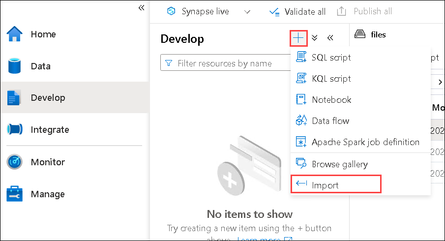

# Lab 06: Transform data using Spark in Synapse Analytics

Data *engineers* often use Spark notebooks as one of their preferred tools to perform *extract, transform, and load (ETL)* or *extract, load, and transform (ELT)* activities that transform data from one format or structure to another.

## Task 1: Provision an Azure Synapse Analytics workspace

In this task, you'll use a Spark notebook in Azure Synapse Analytics to transform data in files.

You'll need an Azure Synapse Analytics workspace with access to data lake storage and a Spark pool.

In this task, you'll use a combination of a PowerShell script and an ARM template to provision an Azure Synapse Analytics workspace.


1. In Azure Portal, click on the **Cloud Shell** button **[\>_]** to the right of the search bar at the top of the page to create a new Cloud Shell, select  ***PowerShell*** environment and click on **Create Storage**. The cloud shell provides a command line interface in a pane at the bottom of the Azure portal, as shown here:

    

2. Note that you can resize the cloud shell by dragging the separator bar at the top of the pane, or by using the **&#8212;**, **&#9723;**, and **X** icons at the top right of the pane to minimize, maximize, and close the pane. For more information about using the Azure Cloud Shell, see the [Azure Cloud Shell documentation](https://docs.microsoft.com/azure/cloud-shell/overview).

3. In the PowerShell pane, enter the following commands to clone this repo:

    ```
    rm -r dp-203 -f
    git clone https://github.com/MicrosoftLearning/dp-203-azure-data-engineer dp-203
    ```

4. After the repo has been cloned, enter the following commands to change to the folder for this exercise and run the **setup.ps1** script it contains:

    ```
    cd dp-203/Allfiles/labs/06
    ./setup.ps1
    ```

5. If prompted, choose which subscription you want to use (this will only happen if you have access to multiple Azure subscriptions).

6. When prompted, enter a suitable password to be set for the Azure Synapse SQL pool.

    > **Note**: Be sure to remember this password!

7. Wait for the script to complete - this typically takes around 10 minutes, but in some cases may take longer. While you are waiting, review the [Apache Spark in Azure Synapse Analytics Core Concepts](https://learn.microsoft.com/azure/synapse-analytics/spark/apache-spark-concepts) article in the Azure Synapse Analytics documentation.

## Task 2: Use a Spark notebook to transform data

1. After the deployment script has completed, in the Azure portal, go to the **dp203-*xxxxxxx*** resource group that it created, and notice that this resource group contains your Synapse workspace, a Storage account for your data lake, and an Apache Spark pool.

2. Select your Synapse workspace, and in its **Overview** page, in the **Open Synapse Studio** card, select **Open** to open Synapse Studio in a new browser tab, sign in if prompted.

3. On the left side of Synapse Studio, use the **&rsaquo;&rsaquo;** icon to expand the menu - this reveals the different pages within Synapse Studio that you'll use to manage resources and perform data analytics tasks.

4. On the **Manage** page, select the **Apache Spark pools** tab and note that a Spark pool with a name similar to **sparkxxxxxxx** has been provisioned in the workspace.

5. On the **Data** page, view the **Linked** tab and verify that your workspace includes a link to your Azure Data Lake Storage Gen2 storage account, which should have a name similar to **synapse*xxxxxxx* (Primary - datalakexxxxxxx)**.

6. Expand your storage account and verify that it contains a file system container named **files (Primary)**.

7. Select the **files** container, and note that it contains folders named **data** and **synapse**. The synapse folder is used by Azure Synapse, and the **data** folder contains the data files you are going to query.

8. Open the **data** folder and observe that it contains .csv files for three years of sales data.

9. Right-click any of the files and select **Preview** to see the data it contains. Note that the files contain a header row, so you can select the option to display column headers.

10. Close the preview. Then download the **Spark Transform.ipynb** from [https://raw.githubusercontent.com/MicrosoftLearning/dp-203-azure-data-engineer/master/Allfiles/labs/06/notebooks/Spark%20Transform.ipynb](https://raw.githubusercontent.com/MicrosoftLearning/dp-203-azure-data-engineer/master/Allfiles/labs/06/notebooks/Spark%20Transform.ipynb)

    > **Note**: It's best to copy this text using the ***ctrl+a*** then ***ctrl+c*** and pasting into a tool using ***ctrl+v***, such as, notepad and then using file, save as **Spark Transform.ipynb** with a filetype of ***all files***.

11. Then on **Develop** page, click on the **+** icon, then select Import option.

    
        
12. Select the file you just downloaded and saved as **Spark Transfrom.ipynb**.

13. Attach the notebook to your **sparkxxxxxxx** Spark pool.

    >**Note**: If you don't find the **Attach to** option, kindly collapse the **Develop** pane to view the **Attach to** option next to the outline option.

14. Review the notes in the notebook and run the each code cells.

    > **Note**: The first code cell will take a few minutes to run because the Spark pool must be started. Subsequent cells will run more quickly.

  **Congratulations** on completing the lab! Now, it's time to validate it. Here are the steps:

  > - Navigate to the Lab Validation tab, from the upper right corner in the lab guide section.
  > - Hit the Validate button for the corresponding task. If you receive a success message, you have successfully validated the lab. 
  > - If not, carefully read the error message and retry the step, following the instructions in the lab guide.
  > - If you need any assistance, please contact us at labs-support@spektrasystems.com.

### You have successfully completed the lab.
