# Lab 2: Use an Apache Spark notebook in a pipeline

## Lab Scenario

In this lab, we're going to create an Azure Synapse Analytics pipeline that includes an activity to run an Apache Spark notebook.

### Lab Objectives
  
In this lab, you will be able to complete the following tasks:

- Task 1: Provision an Azure Synapse Analytics workspace
- Task 2: Run a Spark notebook interactively
- Task 3: Run the notebook in a pipeline

### Estimated timing: 45 minutes

### Architecture Diagram

   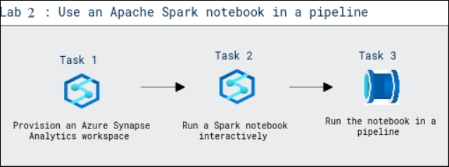

## Task 1: Provision an Azure Synapse Analytics workspace

You'll need an Azure Synapse Analytics workspace with access to data lake storage and a Spark pool.

In this task, you'll use a combination of a PowerShell script and an ARM template to provision an Azure Synapse Analytics workspace.

1. Use the **[\>_]** button to the right of the search bar at the top of the page to create a new Cloud Shell in the Azure portal, and select ***PowerShell*** environment.
    
    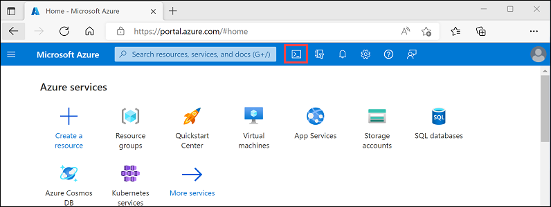

    
   
2. In the **Getting Started** menu,choose **No storage account required (1)**,select your default **Subscription (2)** from the dropdown and click on **Apply (3)**

   

3. Note that Cloud Shell can be resized by dragging the separator bar at the top of the pane, or by using the—, **&#9723;**, and **X** icons at the top right of the pane to minimize, maximize, and close the pane. For more information about using the Azure Cloud Shell, see the [Azure Cloud Shell documentation](https://docs.microsoft.com/azure/cloud-shell/overview).

4. In the PowerShell pane, enter the following commands to clone this repository:

    ```powershell
    rm -r dp-203 -f
    git clone https://github.com/MicrosoftLearning/dp-203-azure-data-engineer dp-203
    ```

5. After the repository has been cloned, enter the following commands to change to the folder for this exercise, and run the **setup.ps1** script it contains:

    ```powershell
    cd dp-203/Allfiles/labs/11
    ./setup.ps1
    ```
    
6. If prompted, choose which subscription you want to use (this will only happen if you have access to multiple Azure subscriptions).
7. When prompted, enter a suitable password to be set for your Azure Synapse SQL pool.

    > **Note**: Be sure to remember this password!

8. Wait for the script to complete - this typically takes around 10 minutes, but in some cases may take longer. While you're waiting, review the [Azure Synapse Pipelines](https://learn.microsoft.com/en-us/azure/data-factory/concepts-data-flow-performance-pipelines) article in the Azure Synapse Analytics documentation.

## Task 2: Run a Spark notebook interactively

Before automating a data transformation process with a notebook, it can be useful to run the notebook interactively in order to better understand the process you will later automate.

In this task, you will be using synapse workspace to run the Spark Notebook interactively.

1. After the script has completed, in the Azure portal, go to the dp203-xxxxxxx resource group that it created, and select your Synapse workspace.

2. In the **Overview** page for your Synapse Workspace, in the **Open Synapse Studio** card, select **Open** to open Synapse Studio in a new browser tab; signing in if prompted.

   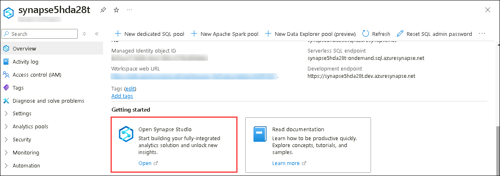

3. On the left side of Synapse Studio, use the ›› icon to expand the menu - this reveals the different pages within Synapse Studio.

4. On the **Data** page, view the Linked tab and verify that your workspace includes a link to your Azure Data Lake Storage Gen2 storage account, which should have a name similar to **synapsexxxxxxx (Primary - datalakexxxxxxx)**.

   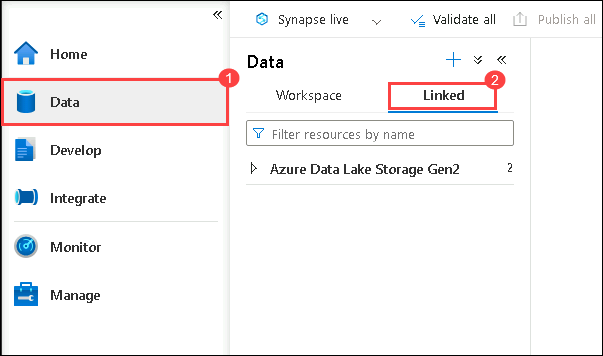

5. Expand your storage account and verify that it contains a file system container named **files (primary)**.

6. Select the files container, and note that it contains a folder named **data**, which contains the data files you're going to transform.

   

7. Open the **data**** folder and view the CSV files it contains. Right-click any of the files and select **Preview** to see a sample of the data. Close the preview when finished.

8. Right-click any of the files and select **Preview** to see the data it contains. Note that the files contain a header row, so you can select the option to display column headers.

9. Close the preview. Then download the **Spark Transform.ipynb** by using the link below through browser.

    ```
    https://github.com/MicrosoftLearning/dp-203-azure-data-engineer/tree/master/Allfiles/labs/11/notebooks
    ```
    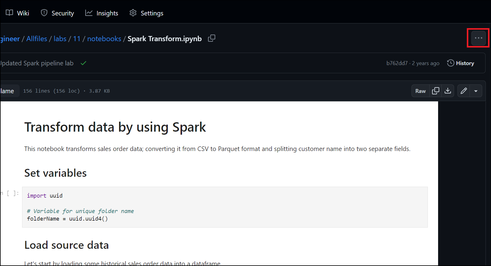


10. Then on **Develop** page, expand **Notebooks** click on the + Import options

    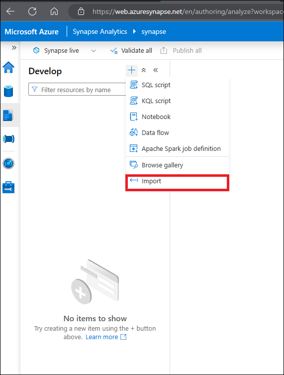
        
11. Select the file you just downloaded and saved as **Spark Transfrom.ipynb**.
12. Attach the notebook to your **spark*xxxxxxx*** Spark pool.

    

13. Review the notes in the notebook and run the code cells.

    > **Note**: The first code cell will take a few minutes to run because the Spark pool must be started. Subsequent cells will run more quickly. 

14. Review the code the notebook contains, noting that it:
    - Sets a variable to define a unique folder name.
    - Loads the CSV sales order data from the **/data** folder.
    - Transforms the data by splitting the customer name into multiple fields.
    - Saves the transformed data in Parquet format in the uniquely named folder.
   
15. In the notebook toolbar, attach the notebook to your **spark*xxxxxxx*** Spark pool and then use the **&#9655; Run All** button to run all of the code cells in the notebook.
  
    The Spark session may take a few minutes to start before the code cells can run.
16. After all of the notebook cells have run, note the name of the folder in which the transformed data has been saved.

17. Switch to the **files** tab (which should still be open) and view the root **files** folder. If necessary, in then **More** menu, select **Refresh** to see the new folder. Then open it to verify that it contains Parquet files.

18. Return to the root **files** folder, then select the uniquely named folder generated by the notebook and in the **New SQL Script** menu, select **Select TOP 100 rows**.

19. In the **Select TOP 100 rows** pane, set the file type to **Parquet format** and apply the change.

20. In the new SQL Script pane that opens, use the **&#9655; Run** button to run the SQL code and verify that it returns the transformed sales order data.

## Task 3: Run the notebook in a pipeline

In this task, you will automate transformation process by encapsulating the notebook in a pipeline.

### Task 3.1: Create a parameters cell

1. In Synapse Studio, return to the **Spark Transform** tab that contains the notebook, and in the toolbar, in the **...** menu at the right end, select **Clear output**.

   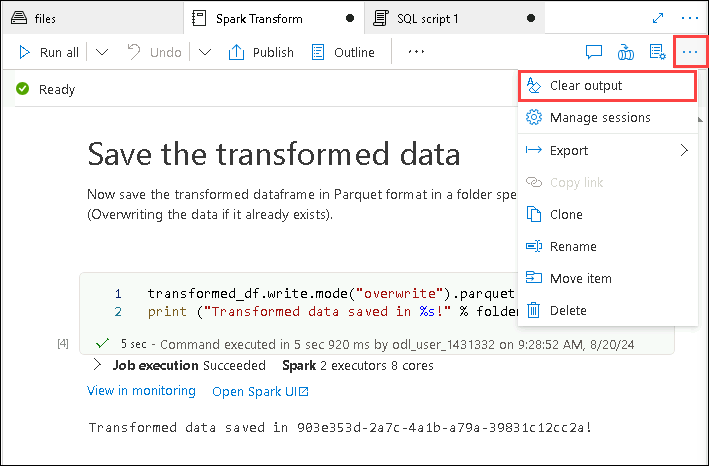

2. Select the first code cell (which contains the code to set the **folderName** variable).

3. In the pop-up toolbar at the top right of the code cell, in the **...** menu, select **\[@] Toggle parameter cell**. Verify that the word **parameters** appears at the bottom right of the cell.

    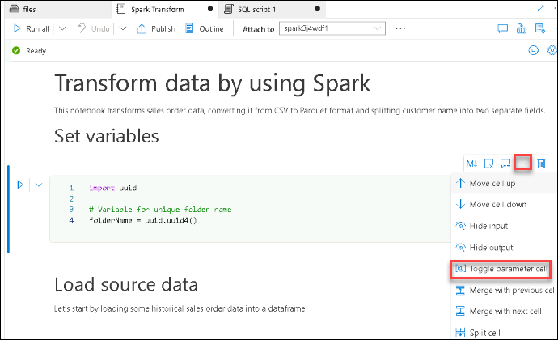

4. In the toolbar, use the **Publish** button to save the changes.

    
### Task 3.2: Create a pipeline

1. In Synapse Studio, select the **Integrate** page. Then in the **+** menu select **Pipeline** to create a new pipeline.

2. In the **Properties** pane for your new pipeline, change its name from **Pipeline1** to **Transform Sales Data**. Then use the **Properties** button above the **Properties** pane to hide it.

3. In the **Activities** pane, expand **Synapse**; and then drag a **Notebook** activity to the pipeline design surface as shown here:

    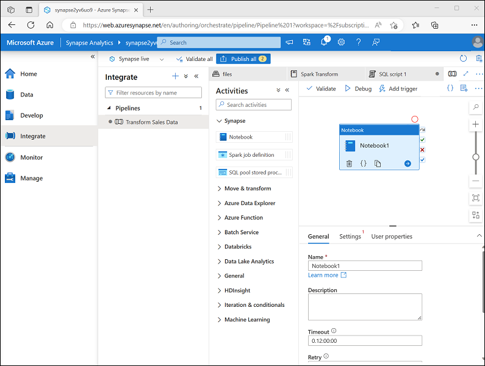

4. In the **General** tab for the Notebook activity, change its name to **Run Spark Transform**.

5. In the **Settings** tab for the Notebook activity, set the following properties:
    - **Notebook**: Select the **Spark Transform** notebook.
    - **Base parameters**: Expand this section and click on **+New** and define a parameter with the following settings:
        - **Name**: folderName
        - **Type**: String
        - **Value**: Select **Add dynamic content** and set the parameter value to the *Pipeline Run ID* system variable (`@pipeline().RunId`)

            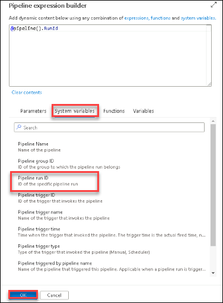

    - **Spark pool**: Select the **spark*xxxxxxx*** pool.
    - **Executor size**: Select **Small (4 vCores, 28GB Memory)**.

    Your pipeline pane should look similar to this:

    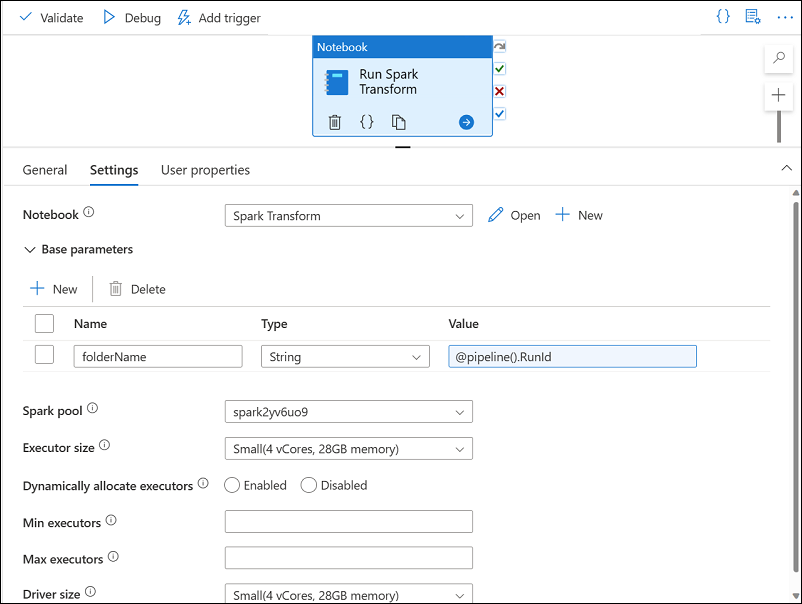

### Task 3.3: Publish and run the pipeline

1. Use the **Publish all** button to publish the pipeline (and any other unsaved assets).
  
   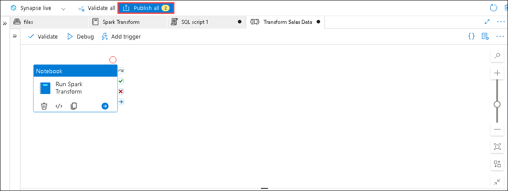

2. At the top of the pipeline designer pane, in the **Add trigger** menu, select **Trigger now**. Then select **OK** to confirm you want to run the pipeline.

   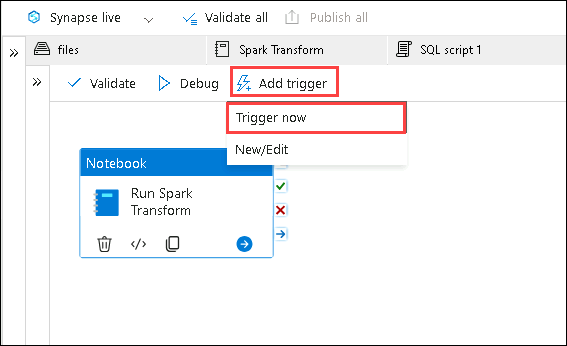

    **Note**: You can also create a trigger to run the pipeline at a scheduled time or in response to a specific event.

3. When the pipeline has started running, on the **Monitor** page, view the **Pipeline runs** tab and review the status of the **Transform Sales Data** pipeline.

   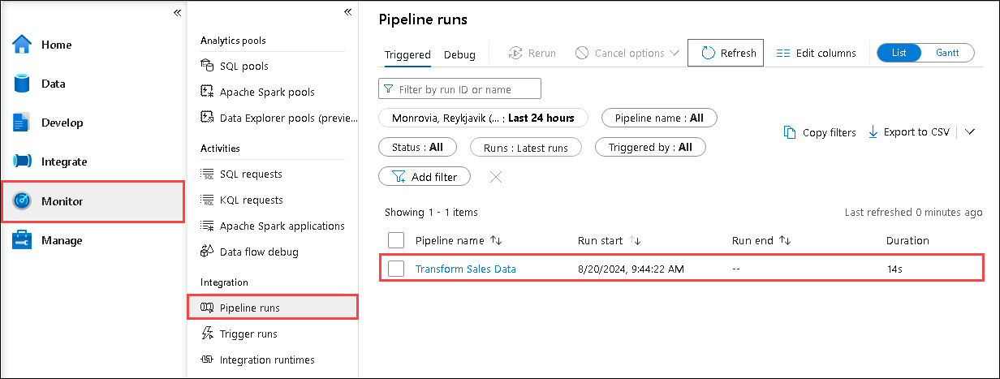

4. Select the **Transform Sales Data** pipeline to view its details, and note the Pipeline run ID in the **Activity runs** pane.

    The pipeline may take five minutes or longer to complete. You can use the **&#8635; Refresh** button on the toolbar to check its status.

5. When the pipeline run has succeeded, on the **Data** page, browse to the **files** storage container and verify that a new folder named for the pipeline run ID has been created, and that it contains Parquet files for the transformed sales data.

   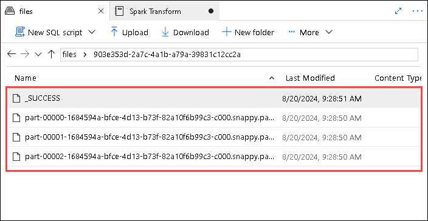

> **Congratulations** on completing the task! Now, it's time to validate it. Here are the steps:
  - Hit the Validate button for the corresponding task. If you receive a success message, you can proceed to the next task. 
  - If not, carefully read the error message and retry the step, following the instructions in the lab guide.
  - If you need any assistance, please contact us at labs-support@spektrasystems.com. We are available 24/7 to help you out.

<validation step="cb57517e-7d94-4fb2-becf-ba2a2de3c858" />
 
## Summary

In this lab, you have performed a series of tasks to enhance your understanding of Spark and its integration with pipelines. You first ran a Spark notebook interactively, allowing you to directly engage with the data and explore its capabilities. Following this, you executed the notebook within a pipeline, demonstrating how to automate and scale the processing of large datasets, thereby streamlining your workflow and enhancing efficiency.

## You have successfully completed the lab.
