# Lab 22: Use Microsoft Purview with Azure Synapse Analytics

Microsoft Purview enables you to catalog data assets across your data estate and track the flow of data as it is transferred from one data source to another - a key element of a comprehensive data governance solution.

## Task 1: Provision Azure resources

In this exercise, you'll use Microsoft Purview to track assets and data lineage in an Azure Synapse Analytics workspace. You'll start by using a script to provision these resources in your Azure subscription.

1. Use the **[\>_]** button to the right of the search bar at the top of the page to create a new Cloud Shell in the Azure portal, selecting a ***PowerShell*** environment and creating storage if prompted. The cloud shell provides a command line interface in a pane at the bottom of the Azure portal, as shown here:

    

    > **Note**: If you have previously created a cloud shell that uses a *Bash* environment, use the the drop-down menu at the top left of the cloud shell pane to change it to ***PowerShell***.

2. Note that you can resize the cloud shell by dragging the separator bar at the top of the pane, or by using the **&#8212;**, **&#9723;**, and **X** icons at the top right of the pane to minimize, maximize, and close the pane. For more information about using the Azure Cloud Shell, see the [Azure Cloud Shell documentation](https://docs.microsoft.com/azure/cloud-shell/overview).

3. In the PowerShell pane, enter the following commands to clone this repo:

    ```
    rm -r dp-203 -f
    git clone -b prod https://github.com/CloudLabs-MOC/dp-203-azure-data-engineer dp-203
    ```

4. After the repo has been cloned, enter the following commands to change to the folder for this lab and run the **setup.ps1** script it contains:

    ```
    cd dp-203/Allfiles/labs/22
    ./setup.ps1
    ```

5. If prompted, choose which subscription you want to use (this will only happen if you have access to multiple Azure subscriptions).
7. When prompted, enter a suitable password for your Azure SQL Database.

    > **Note**: Be sure to remember this password!

8. Wait for the script to complete - this typically takes around 15 minutes, but in some cases may take longer. While you are waiting, review the [What's available in the Microsoft Purview governance portal?](https://docs.microsoft.com/azure/purview/overview) article in the Microsoft Purview documentation.

> **Tip**: If, after running the setup script you decide not to complete the lab, be sure to delete the **dp203-*xxxxxxx*** resource group that was created in your Azure subscription to avoid unnecessary Azure costs.

## Task 2: Catalog Azure Synapse Analytics data assets in Microsoft Purview

With Microsoft Purview, you can catalog data assets across your data estate - including data sources in an Azure Synapse Workspace. The workspace you deployed using a script includes a data lake (in an Azure Data Lake Storage Gen2 account), a serverless database, and a data warehouse in a dedicated SQL pool.

### Task 2.1: Configure role-based access for Microsoft Purview

Microsoft Purview is configured to use a managed identity. In order to catalog data assets, this managed identity account must have access to the Azure Synapse Analytics workspace and the storage account for its data lake store.

1. In the [Azure portal](https://portal.azure.com), browse to the **dp203-*xxxxxxx*** resource group that was created by the setup script and view the resources that it created. These include:
    - A storage account with a name similar to **datalake*xxxxxxx***.
    - A Microsoft Purview account with a name similar to **purview*xxxxxxx***.
    - A dedicated SQL pool with a name similar to **sql*xxxxxxx***.
    - A Synapse workspace with a name similar to **synapse*xxxxxxx***.
2. Open the **datalake*xxxxxxx*** storage account, and on its **Access Control (IAM)** page, view the **Role Assignments** tab; as shown here:

    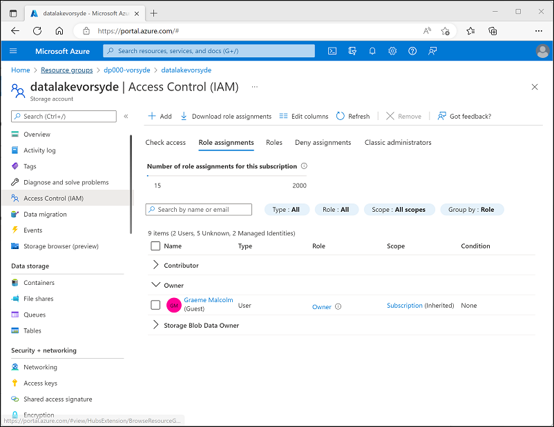

3. On the **+ Add** button menu, select **Add role assignment**. 
4. In the **Add role assigmnent** page, on the **Role** tab, search for "storage blob" and select the **Storage Blob Data Reader** role. Then select **Next** to move to the **Members** tab:

    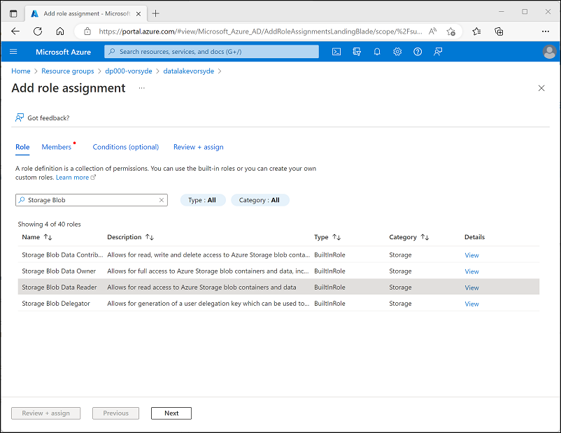

5. On the **Members** tab, in the **Assign access to** list, select **Managed identity**; and then, under **Members**, select **Select members**.
6. In the **Select managed identities** pane, in the **Managed identity** list, select **Microsoft Purview account (*n*)** and select your Microsoft Purview account, which should have a name similar to **purview*xxxxxxx***; and use the **Select** button to add this account to the role assignment:

    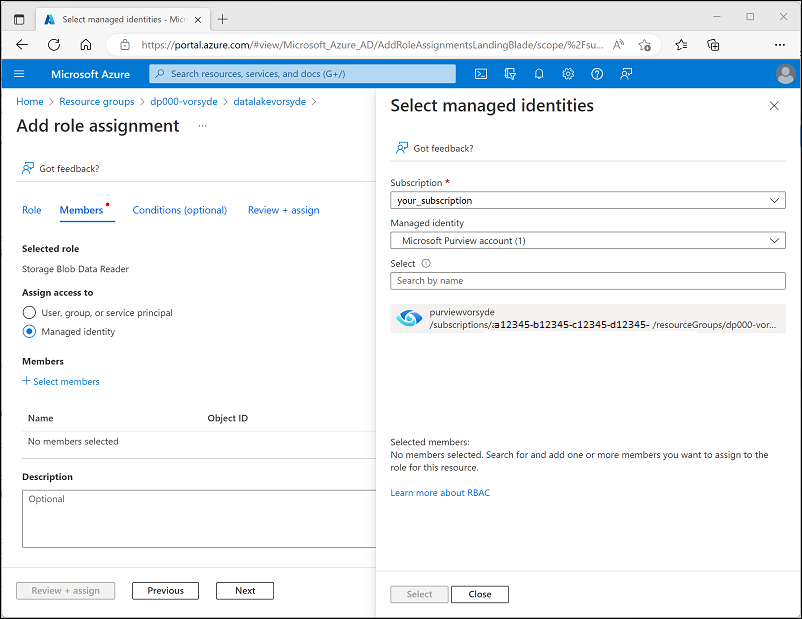

7. Use the **Review + Assign** button to complete the role assignment, which makes the **purview*xxxxxxx*** account used by the managed identity for your Microsoft Purview resource a member of the **Storage Blob Data Reader** role for your storage account.
8. In the Azure portal, return to the **dp203-*xxxxxxx*** resource group and open the **synapse*xxxxxxx*** Synapse Analytics workspace. Then, on its **Access Control (IAM)** page, add a role assignment to make the **purview*xxxxxxx*** managed identity account a member of the **Reader** role in the workspace.

### Task 2.2: Configure database permissions for Microsoft Purview

Your Azure Synapse Analytics workspace includes databases in both *serverless* and *dedicated* SQL pools, to which the managed identity used by Microsoft Purview requires access.

1. In the Azure portal, on the page for your Synapse Analytics workspace, view the **Overview** tab. Then in the **Open Synapse Studio** tile, use the link to open Azure Synapse Studio in a new browser tab - signing in if prompted.

    >**Tip**: Alternatively, you can open Azure Synapse Studio by browsing directly to https://web.azuresynapse.net in a new browser tab.

2. On the left side of Synapse Studio, use the **&rsaquo;&rsaquo;** icon to expand the menu - this reveals the different pages within Synapse Studio.
3. On the **Manage** page, on the **SQL pools** tab, select the row for the **sql*xxxxxxx*** dedicated SQL pool and use its **&#9655;** icon to start it; confirming that you want to resume it when prompted.

    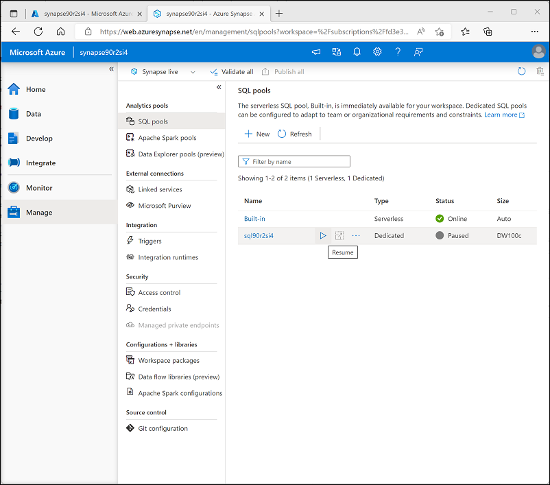

4. Wait for the SQL pool to resume. This can take a few minutes. You can use the **&#8635; Refresh** button to check its status periodically. The status will show as **Online** when it is ready.
5. In Azure Synapse Studio, view the **Data** page, and in the **Workspace** tab, expand **SQL database** to see the databases in your workspace. These should include:
    - A serverless SQL pool database named **lakedb**.
    - A dedicated SQL pool database named **sql*xxxxxxx***.

    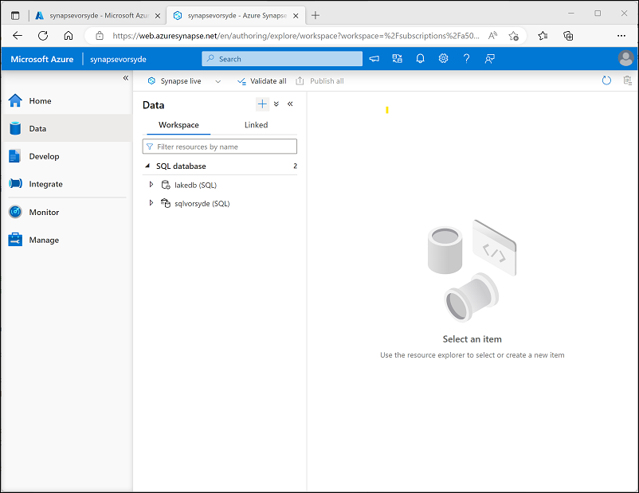

6. Select the **lakedb** database, and then in its **...** menu, select **New SQL script** > **Empty script** to open a new **SQL script 1** pane. You can use the **Properties** button (which looks similar to **&#128463;<sub>*</sub>**) on the right end of the toolbar to hide the **Properties** pane and see the script pane more easily.
7. In the **SQL script 1** pane, enter the following SQL code, replacing all instances of ***purviewxxxxxxx*** with the managed identity name for your Microsoft Purview account:

    ```sql
    CREATE LOGIN purviewxxxxxxx FROM EXTERNAL PROVIDER;
    GO

    CREATE USER purviewxxxxxxx FOR LOGIN purviewxxxxxxx;
    GO

    ALTER ROLE db_datareader ADD MEMBER purviewxxxxxxx;
    GO
    ```

8. Use the **&#9655; Run** button to run the script, which creates a login in the serverless pool and a user in the **lakedb** user for the managed identity used by Microsoft Purview, and adds the user to the **db_datareader** role in the **lakedb** database.
9. Create a new empty script for the **sql*xxxxxxx*** decicated SQL pool database, and use it to run the following SQL code (replacing ***purviewxxxxxxx*** with the managed identity name for your Microsoft Purview account); which creates a user in the dedicated SQL pool for the managed identity used by Microsoft Purview, and adds it to the **db_datareader** role in the **sql*xxxxxxx*** database.

    ```sql
    CREATE USER purviewxxxxxxx FROM EXTERNAL PROVIDER;
    GO

    EXEC sp_addrolemember 'db_datareader', purviewxxxxxxx;
    GO
    ```

### Task 2.3: Register sources in the Microsoft Purview catalog

Now that you've configured the required access for Microsoft Purview to scan the data sources used by your Azure Synapse Analytics workspace, you can register them in your Microsoft Purview catalog.

1. Switch back to the browser tab containing the Azure portal, and view the page for the **dp203-*xxxxxxx*** resource group.
2. Open the **purview*xxxxxxx*** Microsoft Purview account, and on its **Overview** page, use the link to open the **Microsoft Purview Governance Portal** in a  new browser tab - signing in if prompted.

    >**Tip**: Alternatively, you can browse directly to https://web.purview.azure.com in a new browser tab.

3. On the left side of the Azure Purview Governance Portal, use the **&rsaquo;&rsaquo;** icon to expand the menu - this reveals the different pages within the portal.
4. On the **Data map** page, on the **Sources** sub-page, select **Register**:

    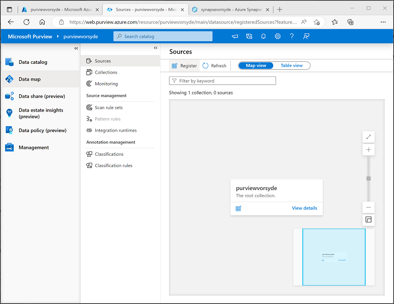

5. In the **Register sources** tab that appears, select **Azure Synapse Analytics**, and continue to register a source with the following settings:
    - **Name**: Synapse_data
    - **Azure subscription**: *Select your Azure subscription*
    - **Workspace name**: *Select your **synapsexxxxxxx** workspace*
    - **Dedicated SQL endpoint**: sql*xxxxxxx*.sql.azuresynapse.net
    - **Serverless SQL endpoint**: sql*xxxxxxx*-ondemand.sql.azuresynapse.net
    - **Select a collection**: Root (purview*xxxxxxx*)

    This data source includes the SQL databases in your Azure Synapse Analytics workspace.

6. After registering the **Synapse_data** source, select **Register** again, and register a second source for the data lake storage used by your Azure Synapse workspace. Select **Azure Data Lake Storage Gen2**, and specify the following settings:
    - **Name**: Data_lake
    - **Azure subscription**: *Select your Azure subscription*
    - **Workspace name**: *Select your **datalakexxxxxxx** storage account*
    - **Endpoint**: https:/ /datalakexxxxxxx.dfs.core.windows.net/
    - **Select a collection**: Root (purview*xxxxxxx*)
    - **Data use management**: Disabled

    After registering both the **Synapse_data** and **Data_lake** sources, they should both be displayed under the **purview*xxxxxxx*** root collection in the data map as shown here:

    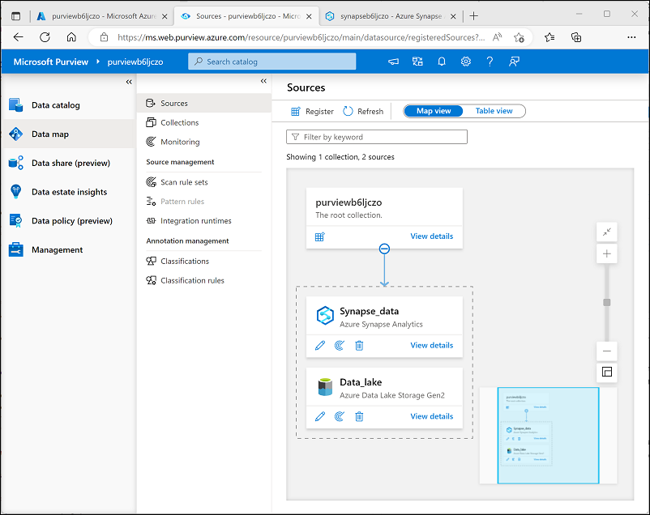

### Task 2.4: Scan registered sources

1. In the data map, in the **Synapse_data** source, select **View details**; and observe that the source has no assets cataloged. You will need to scan the source to find the data assets it contains.
2. In the **Synapse_data** details page, select **New scan**, and then configure a scan with the following settings:
    - **Name**: Scan-Synapse
    - **Connect to integration runtime**: Azure AutoresolveIntegrationRuntime
    - **Type**: SQL Database
    - **Credential**: Microsoft Purview MSI (system)
    - **SQL Database**: *Select <u>both</u> the **sqlxxxxxxx** dedicated database and the **lakedb** serverless database.*
    - **Select a collection**: Root (purview*xxxxxxx*)

    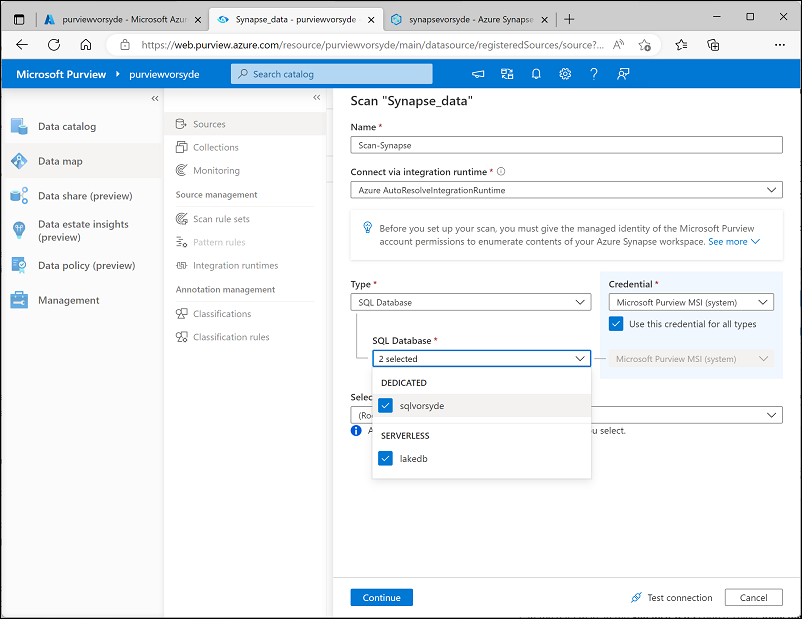

3. Continue to the **Select a scan rule set** page, on which the default **AzureSynapseSQL** rule set should be selected.
4. Continue to the **Set a scan trigger** page, and select **Once** to run the scan one-time.
4. Continue to the **Review your scan** page, and then save and run the scan.
6. While the **Synapse_data** scan is running, return to the **Sources** page to view the data map, and in the **Data_lake** source use the **New scan** icon to start a scan of the data lake with the following settings:
    - **Name**: Scan-Data-Lake
    - **Connect to integration runtime**: Azure AutoresolveIntegrationRuntime
    - **Credential**: Microsoft Purview MSI (system)
    - **Select a collection**: Root (purview*xxxxxxx*)
    - **Scope your scan**: *Select **Data_lake** and all sub-assets* 
    - **Select a scan rule set**:  AdlsGen2
    - **Set a scan trigger**: Once
    - **Review your scan** Save and run
7. Wait for both scans to complete - this may take several minutes. You can view the details page for each of the sources to see the **Last run status**, as shown below (you can use the **&#8635; Refresh** button to update the status). You can also view the **Monitoring** page (though it may take some time for the scans to appear there):

    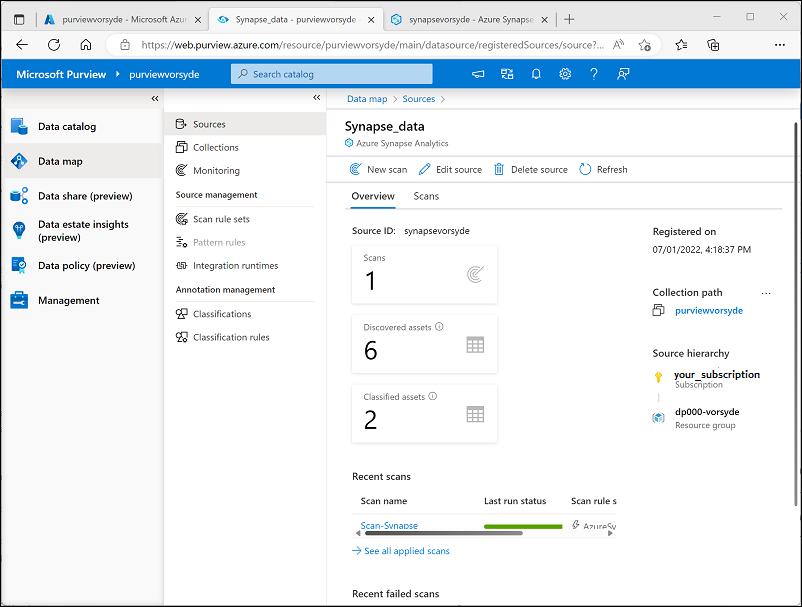

### Task 2.5: View the scanned assets

1. On the **Data catalog** page, on the **Browse** sub-page, select the **purview*xxxxxxx*** collection. Here you can see the data assets that were cataloged in your Azure Synapse Workspace and data lake storage, including the Azure Synapse Analytics workspace, the Azure Storage account for the data lake, the two SQL pool databases in Azure Synapse Analytics, the **dbo** schema in each database, the tables and views in the databases, and the folders and files in the data lake.
2. To filter the results, in the **Narrow results by** list of object types, select **Files** and **Tables** so that only the files, tables, and views that were cataloged by the scan are listed:

    

    Note that the data assets include:

    - **products** - a table in the dedicated SQL pool for product data.
    - **products.csv** - a file in the data lake.
    - **products_csv** - a view in the serverless SQL pool that reads product data from the *products.csv* file.

3. Explore the assets that were found by selecting them and viewing their properties and schema. You can edit the properties of the assets (including individual fields) to add metadata, categorizations, contact details for subject-matter experts, and other useful details so that data analysts can find a lot of information about the data assets in your data estate by exploring them in the Microsoft Purview data catalog.

So far, you've used Microsoft Purview to catalog data assets in your Azure Synapse Analytics workspace. You can register multiple kinds of data source in a Microsoft Purview catalog, enabling you to create a central, consolidated view of data assets.

Now let's explore some other ways to integrate Azure Synapse Analytics and Microsoft Purview.

## Task 3: Integrate Microsoft Purview with Azure Synapse Analytics

Azure Synapse Analytics supports integration with Microsoft Purview to make data assets discoverable and to track data lineage through ingestion pipelines that transfer data from one source to another.

### Task 3.1: Enable Microsoft Purview integration in Azure Synapse Analytics

1. Switch back to the browser tab containing Synapse Studio, and on the **Manage** page, select the **Microsoft Purview** tab, and then use the **Connect to a Purview account** button to connect the **purview*xxxxxxx*** account in your subscription to the workspace.
2. After connecting the account, view the **Purview account** tab to verify that the account is has a **Data Lineage - Synapse Pipeline** status of **Connected**:

    

### Task 3.2: Search the Purview catalog in Synapse Studio

Now that you've connected your Microsoft Purview account to your Azure Synapse Analytics workspace, you can search the catalog from Synapse Studio, enabling you to discover data assets across your data estate.

1. In Synapse Studio, view the **Integrate** page.
2. At the top of the page, use the **Search** box at the top to search the **Purview** source for the term "products", as shown here:

    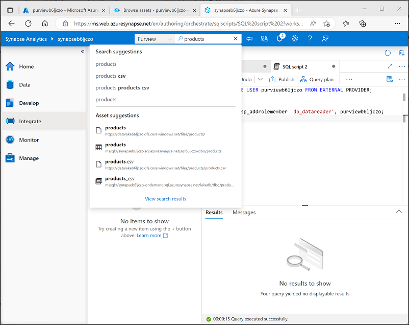

3. In the results, select **products.csv** to view its details from the Purview catalog.

By integrating the Purview catalog into the Synapse Studio interface, data analysts and engineers can find and examine registered data assets from across the entire data estate (not just within the Azure Synapse Studio workspace).

### Task 3.3: Create and run a pipeline

The **products_csv** view in the **lakedb** database is based on a text file in the data lake that contains product data. The **products** table in the **sql*xxxxxxx*** dedicated SQL database is currently empty. Let's use a Synapse pipeline to load data from the data lake into the table.

1. In Synapse Studio, on the **Integrate** page, in the **+** menu, select **Copy Data tool**.
2. In the Copy Data tool, select **Built-in copy task**, and **Run once now**, and then select **Next**.
3. On the **Source data store** page, in the **Connection** list, select the **synapse*xxxxxxx*-WorkspaceDefaultStorage** connection (which references the data lake for the workspace), and for the **File or folder**, browse to the **files/products/products.csv** file. Then select **Next**.
4. On the **File format settings** page, select **Detect text format**. Then ensure the following settings are specified before selecting **Next**:
    - **File format**: DelimitedText
    - **Column delimiter**: Comma (,)
    - **Row delimiter**: Line feed (\n)
    - **First row as header**: Selected
    - **Compression type**: None
5. On the **Destination data store** page, in the **Connection** list, select **sql*xxxxxxx*** (the connection to your dedicated SQL pool). Then set the target to the existing **dbo.products** table, and select **Next**.
6. On the **Column mapping** page, review the default column mappings and then select **Next**.
7. On the **Settings** page, set the **Task name** to **Load_Product_Data**. Then select the **Bulk insert** copy method and select **Next**.
8. On the **Summary** page, select **Next**.
9. Wait for the pipeline to be deployed, and then select **Finish**.
10. In Synapse Studio, view the **Monitor** page. Then on the **Pipeline runs** tab, observe the status of the **Load_Product_Data** pipeline. It may take a few minutes for the status to change to **Succeeded**.
11. When the pipeline run has completed successfully, select its name (**Load_Product_Data**) to view details of the activities in the pipeline; and observe that the pipeline includes a **Copy data** task with an automatically-derived name similar to **Copy_*xxx***. This activity copied the data from the text file in the data lake into the **products** table in the **sql*xxxxxxx*** database.

### Task 3.4: View data lineage in Microsoft Purview

You've used a Synapse pipeline to load data into a database. Let's verify that this activity has been tracked in Microsoft Purview.

1. Switch to the browser tab containing the Microsoft Purview Governance Portal.
2. On the **Data catalog** page, on the **Browse** sub-page, select the **purview*xxxxxxx*** collection.
3. Filter the assets to show only **Data pipelines**, **Files**, and **Tables**. The list of assets should include the **products.csv** file, the **Copy_*xxx*** pipeline activity, and the **products** table.
4. Select the **Copy_*xxx*** asset to view its details, noting the **Updated time** reflects the recent pipeline run.
5. On the **Lineage** tab for the **Copy_*xxx*** asset, view the diagram showing the data flow from the **products.csv** file to the **products** table:

    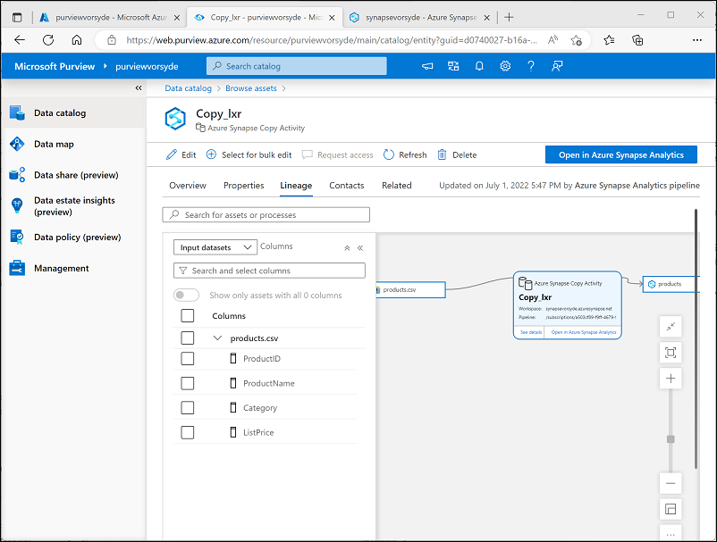

6. In the **Copy_*xxx*** lineage diagram, select the **products.csv** file and use its **Switch to asset** link to view details of the source file.
7. In the **products.csv** lineage diagram, select the **products** table and use its **Switch to asset** link to view details of the table (you may need to use the **&#8635; Refresh** button to see the table lineage diagram).

The lineage tracking capability enabled by integrating Azure Synapse Analytics with Microsoft Purview enables you to determine how and when the data in your data stores was loaded, and where it came from.

> **Tip**: In this exercise, you viewed the lineage information for in the Microsoft Purview Governance portal; but remember that the same assets can also be viewed in Synapse Studio through the search integration feature.

### Task 3.5: Pause the dedicated SQL pool

1. Switch back to the Synapse Studio tab, and on the **Manage** page, pause the **sql*xxxxxxx*** dedicated SQL pool.
