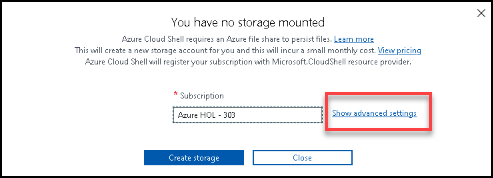
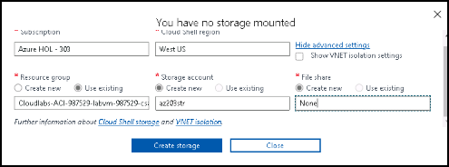
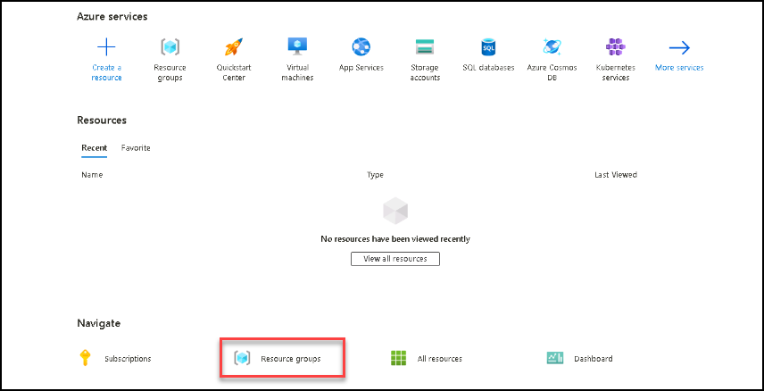
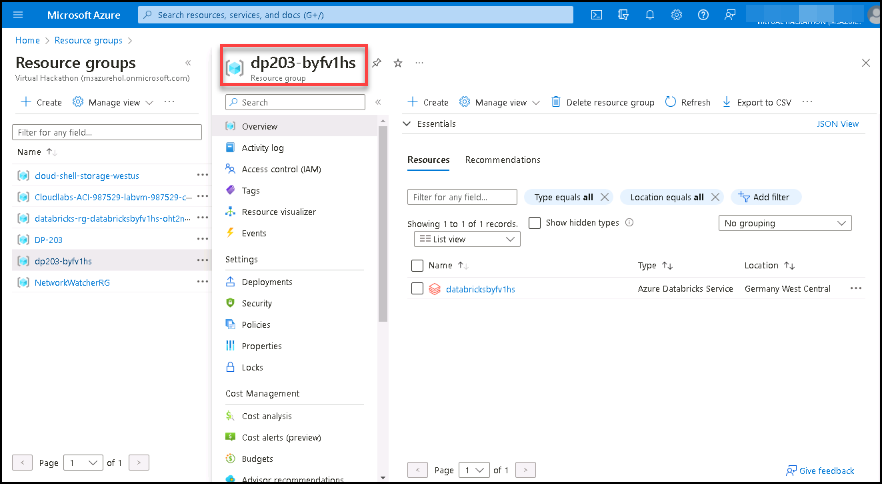
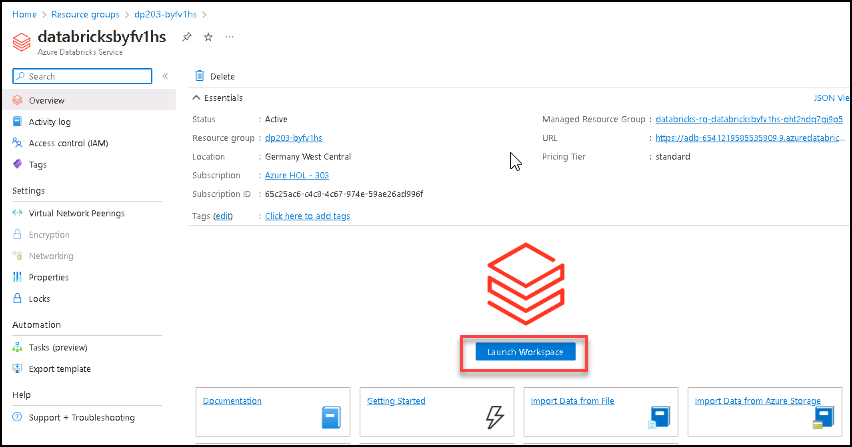
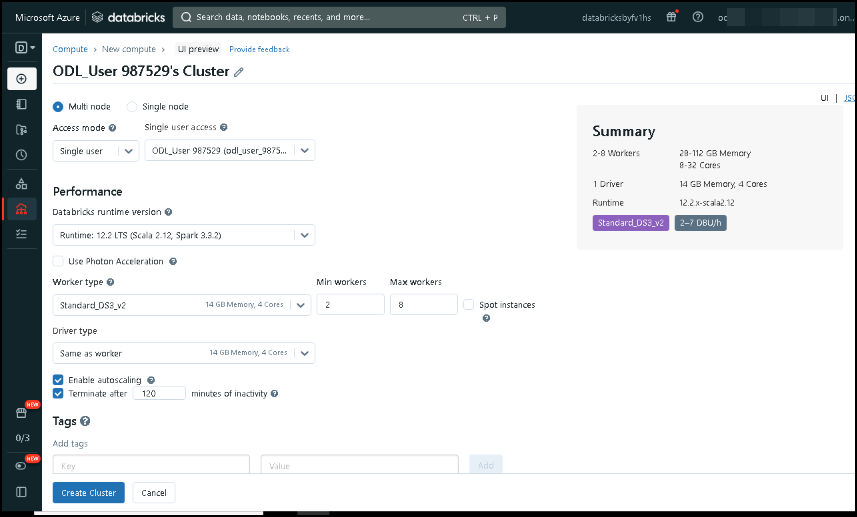
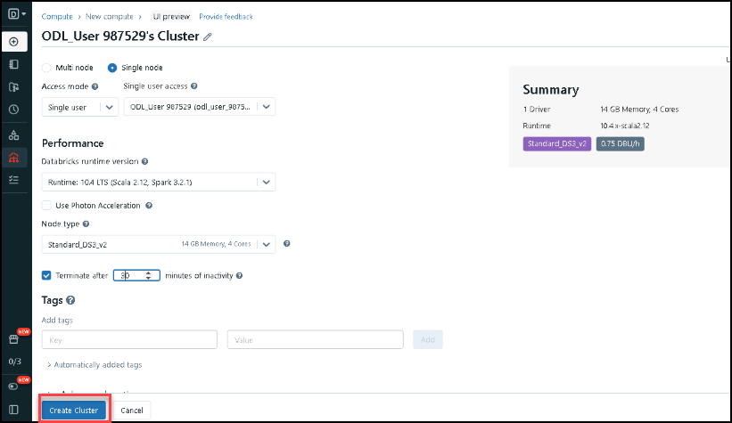

# Lab 25: Use Delta Lake in Azure Databricks

## Lab Scenario

Delta Lake is an open source project to build a transactional data storage layer for Spark on top of a data lake. Delta Lake adds support for relational semantics for both batch and streaming data operations, and enables the creation of a *Lakehouse* architecture in which Apache Spark can be used to process and query data in tables that are based on underlying files in the data lake.

In this lab, you'll learn about Delta Lake which is an open source relational storage area for Spark that you can use to implement a data lakehouse architecture in Azure Databricks.

### Objectives

After completing this lab, you will be able to:

 - Provision an Azure Databricks workspace.
 - Create a cluster.
 - Explore data using a notebook.
 
### Estimated timing: 45 minutes

### Architecture Diagram

   

## Task 1:  Provision an Azure Databricks workspace

In this task, you'll use a script to provision a new Azure Databricks workspace.

> **Tip**: If you already have a *Standard* or *Trial* Azure Databricks workspace, you can skip this procedure.

1. In a web browser, sign into the [Azure portal](https://portal.azure.com) at `https://portal.azure.com`.
2. Use the **[\>_]** button to the right of the search bar at the top of the page to create a new Cloud Shell in the Azure portal.

    

3. Selecting a ***PowerShell*** environment and creating storage if prompted. The cloud shell provides a command line interface in a pane at the bottom of the Azure portal, as shown here:

    

    > **Note**: If you have previously created a cloud shell that uses a *Bash* environment, use the the drop-down menu at the top left of the cloud shell pane to change it to ***PowerShell***.

    


4. If You dont have precreated storage account then select advanced setting.

    

5. Keep all settings default and give unique storage account name and in file share section write **None**.

    

6. Note that you can resize the cloud shell by dragging the separator bar at the top of the pane, or by using the **&#8212;**, **&#9723;**, and **X** icons at the top right of the pane to minimize, maximize, and close the pane. For more information about using the Azure Cloud Shell, see the [Azure Cloud Shell documentation](https://docs.microsoft.com/azure/cloud-shell/overview)

    

7. In the PowerShell pane, enter the following commands to clone this repo:

    ```
    rm -r dp-203 -f
    git clone https://github.com/MicrosoftLearning/dp-203-azure-data-engineer dp-203
    ```

8. After the repo has been cloned, enter the following commands to change to the folder for this lab and run the **setup.ps1** script it contains:

    ```
    cd dp-203/Allfiles/labs/25
    ./setup.ps1
    ```

9. If prompted, choose which subscription you want to use (this will only happen if you have access to multiple Azure subscriptions).

10. Wait for the script to complete - this typically takes around 5 minutes, but in some cases may take longer. While you are waiting, review the [Introduction to Delta Technologies](https://learn.microsoft.com/azure/databricks/introduction/delta-comparison) article in the Azure Databricks documentation.

    

## Task 2: Create a cluster

Azure Databricks is a distributed processing platform that uses Apache Spark *clusters* to process data in parallel on multiple nodes. Each cluster consists of a driver node to coordinate the work, and worker nodes to perform processing tasks.

> **Tip**: If you already have a cluster with a 13.3 LTS runtime version in your Azure Databricks workspace, you can use it to complete this exercise and skip this procedure.

1. In the Azure portal, browse to the **dp203-*xxxxxxx*** resource group that was created by the script you ran.

    

    


2. Select the **databricks*xxxxxxx*** Azure Databricks Service resource.

    

3. In the **Overview** page for **databricks*xxxxxxx***, use the **Launch Workspace** button to open your Azure Databricks workspace in a new browser tab; signing in if prompted.

   > **Tip**: As you use the Databricks Workspace portal, various tips and notifications may be displayed. Dismiss these and follow the instructions provided to complete the tasks in this exercise.

    

4. View the Azure Databricks workspace portal and note that the sidebar on the left side contains icons for the various tasks you can perform.

5. Select the **(+) New** link, and then select **Cluster**.

    

    **Note**: If a tip is displayed, use the **Got it** button to close it. This applies to any future tips that may be displayed as you navigate the workspace interface for the first time.

6. In the **New Cluster** page, create a new cluster with the following settings:
    - **Cluster name**: *User Name's* cluster (the default cluster name)
    - **Cluster mode**: Single Node
    - **Access mode** Single user (*with your user account selected*)
    - **Databricks runtime version**: 13.3 LTS (Spark 3.4.1, Scala 2.12)
    - **Use Photon Acceleration**: Selected
    - **Node type**: Standard_DS3_v2
    - **Terminate after** *30* **minutes of inactivity**

    


7. Wait for the cluster to be created. It may take a minute or two.

    

> **Note**: If your cluster fails to start, your subscription may have insufficient quota in the region where your Azure Databricks workspace is provisioned. See [CPU core limit prevents cluster creation](https://docs.microsoft.com/azure/databricks/kb/clusters/azure-core-limit) for details. If this happens, you can try deleting your workspace and creating a new one in a different region. You can specify a region as a parameter for the setup script like this: `./setup.ps1 eastus`

## Task 3: Explore data lake using a notebook

In this exercise, you'll use code in a notebook to explore delta lake in Azure Databricks.

1. In the Azure Databricks workspace portal for your workspace, in the sidebar on the left, select **Workspace**. Then select the **&#8962; Home** folder.

1. At the top of the page, in the **&#8942;** menu next to your user name, select **Import**. Then in the **Import** dialog box, select **URL** and import the notebook from `https://github.com/MicrosoftLearning/dp-203-azure-data-engineer/raw/master/Allfiles/labs/25/Delta-Lake.ipynb`
   
1. Connect the notebook to your cluster, and follow the instructions it contains; running the cells it contains to explore delta lake functionality.

  **Congratulations** on completing the lab! Now, it's time to validate it. Here are the steps:

  > - Navigate to the Lab Validation tab, from the upper right corner in the lab guide section.
  > - Hit the Validate button for the corresponding task. If you receive a success message, you have successfully validated the lab. 
  > - If not, carefully read the error message and retry the step, following the instructions in the lab guide.
  > - If you need any assistance, please contact us at labs-support@spektrasystems.com.

## Review

In this lab, you have accomplished the following:
 - Provision an Azure Databricks workspace.
 - Create a cluster.
 - Explore data using a notebook.

## You have successfully completed the lab.
